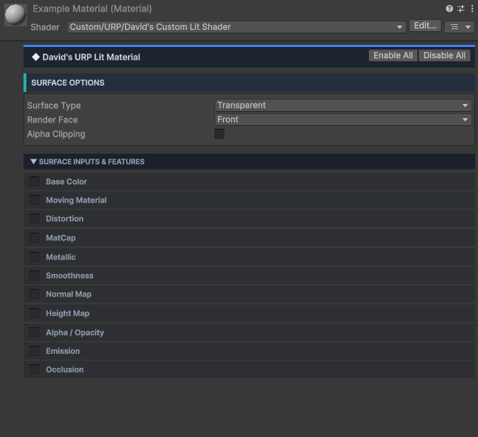
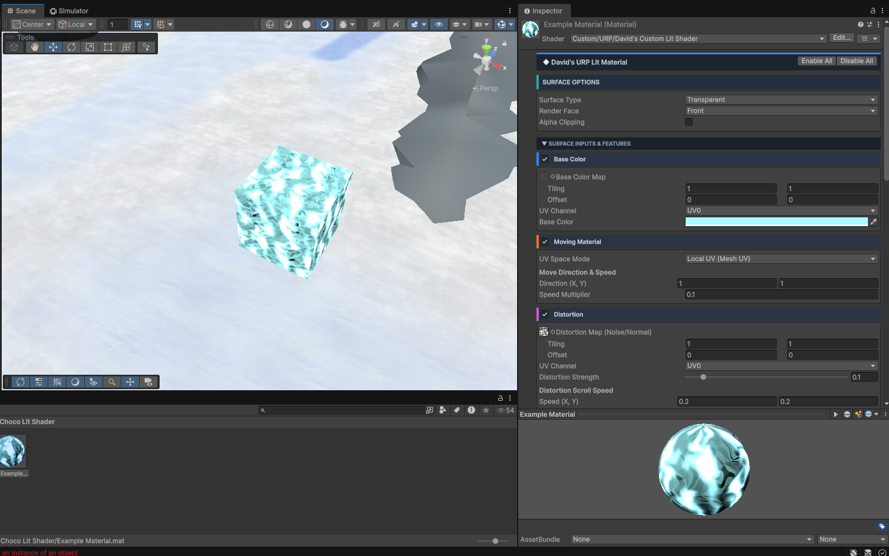

# Custom URP Lit Shader

A custom **Lit Shader for Unity's Universal Render Pipeline (URP)** with configurable surface features, animated UVs, distortion, and additional material controls.

## ✨ Shader Preview

## 🎮 Example

Here is an example material using the shader in Unity:

## 🚀 Features

- Built for **Unity URP**
- Custom Lit shading
- Transparent surface support
- Front / Back / Double-sided rendering
- Base Color and Base Color Map
- Animated / Moving Material UVs
- UV direction and speed controls
- Texture distortion
- Distortion map support
- Adjustable distortion strength
- Distortion scrolling speed
- Metallic control
- Smoothness control
- Normal Map support
- Height Map support
- Alpha / Opacity control
- Emission support
- Occlusion support
- Optional shader features to keep materials lightweight

## 🧩 Material Features

The shader provides optional features that can be enabled directly from the material inspector:

| Feature | Description |
|---|---|
| **Base Color** | Controls the main surface color and texture |
| **Moving Material** | Animates UV coordinates over time |
| **Distortion** | Distorts the material using a noise/normal texture |
| **MatCap** | Adds MatCap-based shading |
| **Metallic** | Controls metallic reflection |
| **Smoothness** | Controls surface smoothness |
| **Normal Map** | Adds surface normal detail |
| **Height Map** | Adds height-based surface detail |
| **Alpha / Opacity** | Controls transparency |
| **Emission** | Adds emissive lighting |
| **Occlusion** | Controls ambient occlusion |

## ⚙️ Moving Material

The **Moving Material** feature allows textures to scroll continuously across the surface.

You can control:

- UV space mode
- Movement direction
- Movement speed
- Speed multiplier

This can be useful for effects such as flowing energy, water, lava, holograms, and other animated materials.

## 🌊 Distortion

The distortion system can use a **Noise/Normal Map** to dynamically distort the material UVs.

Available controls include:

- Distortion Map
- Tiling
- Offset
- UV Channel
- Distortion Strength
- Distortion Scroll Speed
- X/Y Distortion Speed

This makes it possible to create animated and dynamic surface effects.

## 🛠️ Requirements

- Unity
- Universal Render Pipeline (URP)

